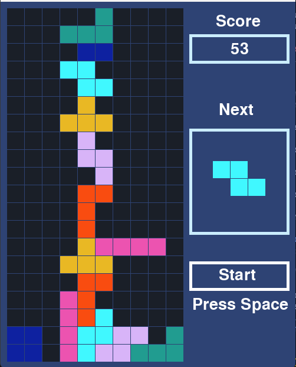

# Thanksgiving-Tetris

추석용 프로젝트: 테트리스를 만들어보자
***

### 점수
* 아래 방향키로 빨리 내리기 했을 때 : 1점
* 1줄 클리어 했을 때: 100점
* 2줄 동시 클리어 했을 때 : 300점
* 3줄 동시 클리어 했을 때 : 500점
* 4줄 동시 클리어 했을 때 : 800점

### 입력
* 게임 시작: 오른쪽 스타트 버튼 클릭 or 스페이스바
* 왼쪽으로 이동: 왼쪽 방향키
* 오른쪽으로 이동: 오른쪽 방향키
* 한칸 밑으로 이동: 아래 방향키
* 회전: 위 방향키

### 블록

* I자형: 4개의 작은 블록이 한 줄로 나열된 모양
* O자형: 4개의 작은 블록이 2x2로 나열된 모양
* T자형: 4개의 작은 블록이 T자형으로 나열된 모양
* L자형: 4개의 작은 블록이 L자형으로 나열된 모양
* J자형: 4개의 작은 블록이 J자형으로 나열된 모양
* S자형: 4개의 작은 블록이 S자형으로 나열된 모양
* z자형: 4개의 작은 블록이 z자형으로 나열된 모양

